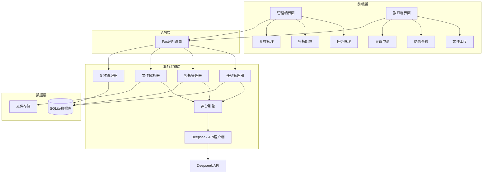

# Design Document: 自动评分系统

## Overview

本设计文档描述了将评教系统从手动评分升级为基于 Deepseek API 的自动评分系统的技术实现方案。系统采用模块化设计，包含文件解析、提示词模板管理、自动评分引擎、复核管理等核心模块。

### 系统定位

**管理端**：
- 自动评分功能集成在"考评任务管理"模块中
- 管理员在考评任务的"操作"菜单中使用"评分"功能
- 管理员可以触发自动评分、查看评分结果、进行人工复核、公示结果

**教师端**：
- 不改变原有功能，不新增界面
- 教师在"待办考评"中上传管理端要求的文件
- 教师可以查看评分结果、提交异议、确认评分

**评分流程**：
1. 管理端创建考评任务，指定需要上传的文件类型
2. 教师端在待办考评中上传文件
3. 管理端在考评任务管理中对上传的文件进行评分（自动或手动）
4. 教师端查看评分结果，可提交异议或确认
5. 管理端处理异议，所有教师确认后公示结果

### 设计目标

1. **自动化评分**：实现5类教学文件的自动评分，减少80%人工工作量
2. **高准确性**：自动评分与人工复核一致性≥95%
3. **可追溯性**：完整记录评分过程和调整历史
4. **可扩展性**：预留接口支持未来系统集成
5. **安全性**：文件加密存储，权限严格控制
6. **无缝集成**：与现有考评任务流程无缝集成，不改变用户习惯

### 技术栈

- **后端**: FastAPI + SQLAlchemy + SQLite
- **前端**: Vue 3 + TypeScript + Element Plus
- **AI服务**: Deepseek API (deepseek-chat)
- **文件解析**: python-docx, PyPDF2, python-pptx
- **加密**: cryptography (Fernet)

## Architecture

### 系统架构图



### 核心流程

#### 自动评分流程


#### 异议处理流程


## Components and Interfaces

### 1. 文件解析器 (File Parser)

**职责**: 提取不同格式文件的文本内容

**接口定义**:

```python
class FileParser:
    def parse_docx(self, file_path: str) -> str:
        """解析 docx 文件，返回文本内容"""
        pass
    
    def parse_pdf(self, file_path: str) -> str:
        """解析 pdf 文件，返回文本内容"""
        pass
    
    def parse_pptx(self, file_path: str) -> str:
        """解析 pptx 文件，返回文本内容"""
        pass
    
    def parse_file(self, file_path: str, file_type: str) -> str:
        """根据文件类型自动选择解析方法"""
        pass
```

**实现细节**:
- 使用 `python-docx` 解析 Word 文档
- 使用 `PyPDF2` 解析 PDF 文档
- 使用 `python-pptx` 解析 PowerPoint 文档
- 处理解析异常，返回错误信息

### 2. 提示词模板管理器 (Template Manager)

**职责**: 管理5类文件的评分标准模板

**接口定义**:

```python
class TemplateManager:
    def get_template(self, file_type: str) -> dict:
        """获取指定文件类型的提示词模板"""
        pass
    
    def create_template(self, file_type: str, template_data: dict) -> int:
        """创建新的提示词模板"""
        pass
    
    def update_template(self, template_id: int, template_data: dict) -> bool:
        """更新提示词模板"""
        pass
    
    def build_prompt(self, file_type: str, content: str, bonus_rules: dict) -> str:
        """根据模板和文件内容构建完整提示词"""
        pass
```

**模板结构**:

```python
{
    "file_type": "教案",
    "grade_standards": {
        "excellent": {"min": 90, "max": 100},
        "good": {"min": 80, "max": 89},
        "pass": {"min": 60, "max": 79},
        "fail": {"min": 0, "max": 59}
    },
    "core_indicators": [
        {"name": "教学目标", "weight": 25, "description": "..."},
        {"name": "教学内容", "weight": 25, "description": "..."},
        {"name": "教学方法", "weight": 25, "description": "..."},
        {"name": "教学评价", "weight": 25, "description": "..."}
    ],
    "veto_items": {
        "general": ["造假", "师德失范", "未提交核心文件"],
        "specific": ["教学目标缺失", "教学内容严重错误"]
    },
    "bonus_rules": {
        "max_bonus": 10,
        "items": [
            {"name": "获奖", "max_score": 5},
            {"name": "创新", "max_score": 5}
        ]
    },
    "output_format": {
        "score_details": "各指标得分明细",
        "veto_check": "否决项校验结果",
        "grade": "等级",
        "summary": "总结"
    }
}
```


### 3. 自动评分引擎 (Scoring Engine)

**职责**: 调用 Deepseek API 进行评分并处理结果

**接口定义**:

```python
class ScoringEngine:
    def __init__(self, api_key: str, api_url: str):
        self.api_key = api_key
        self.api_url = api_url
        self.model = "deepseek-chat"
        self.temperature = 0.1
    
    def score_file(self, file_id: int, content: str, file_type: str, 
                   bonus_items: list) -> dict:
        """对单个文件进行评分"""
        pass
    
    def batch_score(self, file_ids: list) -> list:
        """批量评分"""
        pass
    
    def call_api(self, prompt: str) -> dict:
        """调用 Deepseek API"""
        pass
    
    def parse_api_response(self, response: dict) -> dict:
        """解析 API 返回结果"""
        pass
    
    def calculate_final_score(self, base_score: float, bonus_items: list) -> dict:
        """计算最终得分（基础分+加分项）"""
        pass
    
    def determine_grade(self, final_score: float) -> str:
        """根据得分确定等级"""
        pass
```

**评分逻辑**:

```python
def score_file(self, file_id: int, content: str, file_type: str, 
               bonus_items: list) -> dict:
    # 1. 获取提示词模板
    template = self.template_manager.get_template(file_type)
    
    # 2. 构建提示词
    prompt = self.template_manager.build_prompt(file_type, content, template)
    
    # 3. 调用 API
    api_response = self.call_api(prompt)
    
    # 4. 解析结果
    parsed_result = self.parse_api_response(api_response)
    
    # 5. 检查否决项
    if parsed_result['veto_triggered']:
        return {
            'file_id': file_id,
            'base_score': 0,
            'final_score': 0,
            'grade': '不合格',
            'veto_reason': parsed_result['veto_reason'],
            'details': parsed_result['details']
        }
    
    # 6. 计算加分项
    final_result = self.calculate_final_score(
        parsed_result['base_score'], 
        bonus_items
    )
    
    # 7. 确定等级
    final_result['grade'] = self.determine_grade(final_result['final_score'])
    
    return final_result
```

### 4. 复核管理器 (Review Manager)

**职责**: 处理异议申请和人工复核

**接口定义**:

```python
class ReviewManager:
    def submit_appeal(self, file_id: int, teacher_id: int, reason: str) -> int:
        """提交异议申请"""
        pass
    
    def get_pending_appeals(self) -> list:
        """获取待处理的异议列表"""
        pass
    
    def manual_review(self, file_id: int, admin_id: int, new_score: dict) -> bool:
        """管理员人工复核并调整评分"""
        pass
    
    def random_sample(self, sample_rate: float) -> list:
        """随机抽取样本进行复核"""
        pass
    
    def record_review_result(self, file_id: int, is_consistent: bool, 
                            difference_reason: str) -> bool:
        """记录复核结果"""
        pass
    
    def calculate_consistency_rate(self, start_date: str, end_date: str) -> float:
        """计算一致性比例"""
        pass
    
    def confirm_score(self, file_id: int, teacher_id: int) -> bool:
        """教师确认评分结果"""
        pass
    
    def publish_results(self, task_id: int) -> bool:
        """公示整体评分结果"""
        pass
```

### 5. 任务管理器 (Task Manager)

**职责**: 管理考评任务的创建和分发

**接口定义**:

```python
class TaskManager:
    def create_task(self, task_data: dict) -> int:
        """创建考评任务"""
        pass
    
    def assign_task(self, task_id: int, teacher_ids: list) -> bool:
        """分配任务给教师"""
        pass
    
    def check_deadline(self) -> list:
        """检查截止时间，返回超时未提交的记录"""
        pass
    
    def trigger_veto_for_overdue(self, submission_ids: list) -> bool:
        """对超时未提交的记录触发一票否决"""
        pass
```


## Data Models

### 数据库表结构

#### 1. ScoringTemplate (评分模板表)

```python
class ScoringTemplate(Base):
    __tablename__ = "scoring_templates"
    
    id = Column(Integer, primary_key=True)
    file_type = Column(String(50), nullable=False, unique=True)  # 文件类型
    template_content = Column(Text, nullable=False)  # JSON格式的模板内容
    is_active = Column(Boolean, default=True)  # 是否启用
    created_at = Column(DateTime, default=datetime.utcnow)
    updated_at = Column(DateTime, default=datetime.utcnow, onupdate=datetime.utcnow)
    created_by = Column(Integer, ForeignKey("users.id"))
```

#### 2. ScoringRecord (评分记录表)

```python
class ScoringRecord(Base):
    __tablename__ = "scoring_records"
    
    id = Column(Integer, primary_key=True)
    submission_id = Column(Integer, ForeignKey("material_submissions.id"), nullable=False)
    file_type = Column(String(50), nullable=False)
    base_score = Column(Float, nullable=False)  # 基础分
    bonus_score = Column(Float, default=0)  # 加分
    final_score = Column(Float, nullable=False)  # 最终得分
    grade = Column(String(20), nullable=False)  # 等级
    score_details = Column(Text)  # JSON格式的得分明细
    veto_triggered = Column(Boolean, default=False)  # 是否触发否决项
    veto_reason = Column(Text)  # 否决原因
    scoring_type = Column(String(20), default="auto")  # auto/manual
    scored_by = Column(Integer, ForeignKey("users.id"))  # 评分人（自动评分时为系统）
    scored_at = Column(DateTime, default=datetime.utcnow)
    is_confirmed = Column(Boolean, default=False)  # 教师是否确认
    confirmed_at = Column(DateTime)  # 确认时间
```

#### 3. ScoringAppeal (评分异议表)

```python
class ScoringAppeal(Base):
    __tablename__ = "scoring_appeals"
    
    id = Column(Integer, primary_key=True)
    scoring_record_id = Column(Integer, ForeignKey("scoring_records.id"), nullable=False)
    teacher_id = Column(Integer, ForeignKey("users.id"), nullable=False)
    appeal_reason = Column(Text, nullable=False)  # 异议理由
    status = Column(String(20), default="pending")  # pending/reviewing/resolved
    reviewed_by = Column(Integer, ForeignKey("users.id"))  # 复核人
    review_result = Column(Text)  # 复核结果
    created_at = Column(DateTime, default=datetime.utcnow)
    reviewed_at = Column(DateTime)
```

#### 4. ReviewRecord (复核记录表)

```python
class ReviewRecord(Base):
    __tablename__ = "review_records"
    
    id = Column(Integer, primary_key=True)
    scoring_record_id = Column(Integer, ForeignKey("scoring_records.id"), nullable=False)
    review_type = Column(String(20), nullable=False)  # random/appeal
    original_score = Column(Float, nullable=False)
    reviewed_score = Column(Float, nullable=False)
    is_consistent = Column(Boolean, nullable=False)  # 是否一致
    difference_reason = Column(Text)  # 差异原因
    reviewed_by = Column(Integer, ForeignKey("users.id"), nullable=False)
    reviewed_at = Column(DateTime, default=datetime.utcnow)
```

#### 5. BonusItem (加分项表)

```python
class BonusItem(Base):
    __tablename__ = "bonus_items"
    
    id = Column(Integer, primary_key=True)
    submission_id = Column(Integer, ForeignKey("material_submissions.id"), nullable=False)
    item_name = Column(String(100), nullable=False)  # 加分项名称
    score = Column(Float, nullable=False)  # 加分值
    evidence = Column(Text)  # 佐证材料
    added_by = Column(Integer, ForeignKey("users.id"), nullable=False)
    added_at = Column(DateTime, default=datetime.utcnow)
```

#### 6. ScoringLog (评分日志表)

```python
class ScoringLog(Base):
    __tablename__ = "scoring_logs"
    
    id = Column(Integer, primary_key=True)
    scoring_record_id = Column(Integer, ForeignKey("scoring_records.id"), nullable=False)
    action = Column(String(50), nullable=False)  # create/update/appeal/review
    action_by = Column(Integer, ForeignKey("users.id"))
    action_details = Column(Text)  # JSON格式的详细信息
    created_at = Column(DateTime, default=datetime.utcnow)
```

#### 7. 扩展现有表

**MaterialSubmission (材料提交表) - 添加字段**:

```python
# 新增字段
scoring_status = Column(String(20), default="pending")  # pending/scoring/scored/failed
parsed_content = Column(Text)  # 解析后的文本内容
file_hash = Column(String(64))  # 文件哈希值
encrypted_path = Column(String(500))  # 加密后的文件路径
```

**EvaluationAssignmentTask (考评任务表) - 添加字段**:

```python
# 新增字段
required_file_types = Column(Text)  # JSON格式的必需文件类型列表
bonus_enabled = Column(Boolean, default=True)  # 是否启用加分项
max_bonus_score = Column(Float, default=10)  # 最大加分值
auto_scoring_enabled = Column(Boolean, default=True)  # 是否启用自动评分
```


## API 设计

### 1. 提示词模板管理 API

#### 获取模板列表
```
GET /api/scoring/templates
Response: {
    "templates": [
        {
            "id": 1,
            "file_type": "教案",
            "is_active": true,
            "updated_at": "2024-01-01T00:00:00"
        }
    ]
}
```

#### 获取模板详情
```
GET /api/scoring/templates/{file_type}
Response: {
    "id": 1,
    "file_type": "教案",
    "template_content": {...},
    "is_active": true
}
```

#### 创建/更新模板
```
POST /api/scoring/templates
PUT /api/scoring/templates/{id}
Request: {
    "file_type": "教案",
    "template_content": {...}
}
```

### 2. 自动评分 API

#### 触发单个文件评分
```
POST /api/scoring/score/{submission_id}
Request: {
    "bonus_items": [
        {"item_name": "获奖", "score": 5, "evidence": "..."}
    ]
}
Response: {
    "scoring_record_id": 123,
    "base_score": 85,
    "bonus_score": 5,
    "final_score": 90,
    "grade": "优秀",
    "details": {...}
}
```

#### 批量评分
```
POST /api/scoring/batch-score
Request: {
    "submission_ids": [1, 2, 3, 4, 5]
}
Response: {
    "total": 5,
    "success": 4,
    "failed": 1,
    "results": [...]
}
```

#### 获取评分结果
```
GET /api/scoring/records/{submission_id}
Response: {
    "id": 123,
    "submission_id": 456,
    "final_score": 90,
    "grade": "优秀",
    "score_details": {...},
    "is_confirmed": false
}
```

### 3. 复核管理 API

#### 提交异议
```
POST /api/scoring/appeals
Request: {
    "scoring_record_id": 123,
    "appeal_reason": "我认为评分不合理..."
}
```

#### 获取异议列表
```
GET /api/scoring/appeals?status=pending
Response: {
    "appeals": [
        {
            "id": 1,
            "scoring_record_id": 123,
            "teacher_name": "张三",
            "appeal_reason": "...",
            "status": "pending",
            "created_at": "2024-01-01T00:00:00"
        }
    ]
}
```

#### 人工复核
```
POST /api/scoring/manual-review
Request: {
    "scoring_record_id": 123,
    "new_score": {
        "base_score": 88,
        "bonus_score": 5,
        "final_score": 93,
        "grade": "优秀",
        "review_reason": "重新评估后..."
    }
}
```

#### 教师确认评分
```
POST /api/scoring/confirm/{scoring_record_id}
Response: {
    "success": true,
    "message": "评分结果已确认"
}
```

#### 随机抽查
```
POST /api/scoring/random-sample
Request: {
    "task_id": 1,
    "sample_rate": 0.1
}
Response: {
    "sampled_records": [...]
}
```

#### 记录复核结果
```
POST /api/scoring/review-result
Request: {
    "scoring_record_id": 123,
    "is_consistent": true,
    "difference_reason": ""
}
```

#### 公示结果
```
POST /api/scoring/publish/{task_id}
Response: {
    "success": true,
    "published_count": 50
}
```

### 4. 统计分析 API

#### 一致性统计
```
GET /api/scoring/consistency?start_date=2024-01-01&end_date=2024-01-31
Response: {
    "total_reviews": 100,
    "consistent_count": 96,
    "consistency_rate": 0.96,
    "difference_reasons": {
        "评分标准理解偏差": 2,
        "文件内容理解偏差": 2
    }
}
```

#### 导出评分结果
```
GET /api/scoring/export?task_id=1&format=excel
Response: Excel文件下载
```


## 提示词模板设计

### 模板设计原则

1. **结构化输出**: 要求 API 返回 JSON 格式的结构化数据
2. **明确标准**: 详细描述每个指标的评分标准
3. **否决项优先**: 先检查否决项，再进行详细评分
4. **可解释性**: 要求提供扣分理由和改进建议

### 通用提示词框架

```
你是一位专业的教学评估专家，请根据以下标准对教学文件进行评分。

【评分规则】
1. 首先检查一票否决项，如果触发则直接判定为不合格
2. 如果未触发否决项，则按核心指标进行评分
3. 总分100分，按指标权重分配
4. 最终得分将加上加分项（最多10分）

【一票否决项】
通用否决项：
- 存在造假行为（抄袭、伪造数据等）
- 存在师德失范内容
- 未提交核心文件或文件内容为空

专项否决项：
{specific_veto_items}

【核心指标】
{core_indicators}

【等级标准】
- 优秀：90-100分
- 良好：80-89分
- 合格：60-79分
- 不合格：<60分

【待评分文件内容】
{file_content}

【输出格式要求】
请严格按照以下JSON格式输出评分结果：
{
    "veto_check": {
        "triggered": false,
        "reason": ""
    },
    "score_details": [
        {
            "indicator": "指标名称",
            "score": 分数,
            "max_score": 满分,
            "reason": "评分理由"
        }
    ],
    "base_score": 总分,
    "grade_suggestion": "等级",
    "summary": "总体评价和改进建议"
}
```

### 教案评分模板

```python
LESSON_PLAN_TEMPLATE = """
你是一位专业的教学评估专家，请根据以下标准对教案进行评分。

【评分规则】
1. 首先检查一票否决项，如果触发则直接判定为不合格
2. 如果未触发否决项，则按核心指标进行评分
3. 总分100分，4个核心指标各占25分

【一票否决项】
通用否决项：
- 存在造假行为（抄袭、伪造数据等）
- 存在师德失范内容
- 未提交核心文件或文件内容为空

专项否决项：
- 教学目标完全缺失
- 教学内容存在严重知识性错误
- 教学方法完全不适合教学内容

【核心指标】（总分100分）

1. 教学目标（25分）
   - 目标明确具体（10分）：目标清晰、可测量、可达成
   - 符合课程标准（8分）：与课程标准要求一致
   - 关注学生发展（7分）：体现知识、能力、情感态度价值观

2. 教学内容（25分）
   - 内容准确完整（10分）：知识点准确无误、覆盖全面
   - 重难点突出（8分）：明确标注重点难点及突破方法
   - 内容组织合理（7分）：逻辑清晰、层次分明

3. 教学方法（25分）
   - 方法适切有效（10分）：教学方法符合内容特点和学生实际
   - 体现学生主体（8分）：注重学生参与和互动
   - 教学手段多样（7分）：合理运用多种教学手段和资源

4. 教学评价（25分）
   - 评价方式多元（10分）：采用多种评价方式
   - 评价标准明确（8分）：评价标准清晰具体
   - 关注过程评价（7分）：注重形成性评价

【待评分教案内容】
{file_content}

【输出格式要求】
请严格按照以下JSON格式输出评分结果：
{{
    "veto_check": {{
        "triggered": false,
        "reason": ""
    }},
    "score_details": [
        {{
            "indicator": "教学目标",
            "score": 分数,
            "max_score": 25,
            "reason": "评分理由"
        }},
        {{
            "indicator": "教学内容",
            "score": 分数,
            "max_score": 25,
            "reason": "评分理由"
        }},
        {{
            "indicator": "教学方法",
            "score": 分数,
            "max_score": 25,
            "reason": "评分理由"
        }},
        {{
            "indicator": "教学评价",
            "score": 分数,
            "max_score": 25,
            "reason": "评分理由"
        }}
    ],
    "base_score": 总分,
    "grade_suggestion": "等级",
    "summary": "总体评价和改进建议"
}}
"""
```

### 教学反思评分模板

```python
TEACHING_REFLECTION_TEMPLATE = """
你是一位专业的教学评估专家，请根据以下标准对教学反思进行评分。

【评分规则】
1. 首先检查一票否决项，如果触发则直接判定为不合格
2. 如果未触发否决项，则按核心指标进行评分
3. 总分100分，4个核心指标分别占不同权重

【一票否决项】
通用否决项：
- 存在造假行为（抄袭、伪造数据等）
- 存在师德失范内容
- 未提交核心文件或文件内容为空

专项否决项：
- 反思内容与教学完全无关
- 反思内容过于简单（少于200字）
- 完全没有具体教学案例

【核心指标】（总分100分）

1. 反思深度（30分）
   - 问题分析深入（15分）：能够深入分析教学中的问题
   - 原因剖析透彻（15分）：能够找到问题的根本原因

2. 反思内容（30分）
   - 案例具体真实（15分）：有具体的教学案例支撑
   - 覆盖全面（15分）：涵盖教学目标、内容、方法、效果等方面

3. 改进措施（25分）
   - 措施具体可行（15分）：改进措施明确、可操作
   - 针对性强（10分）：措施针对问题提出

4. 理论支撑（15分）
   - 理论联系实际（10分）：能够运用教育理论分析问题
   - 专业性强（5分）：体现教育专业素养

【待评分教学反思内容】
{file_content}

【输出格式要求】
请严格按照以下JSON格式输出评分结果：
{{
    "veto_check": {{
        "triggered": false,
        "reason": ""
    }},
    "score_details": [
        {{
            "indicator": "反思深度",
            "score": 分数,
            "max_score": 30,
            "reason": "评分理由"
        }},
        {{
            "indicator": "反思内容",
            "score": 分数,
            "max_score": 30,
            "reason": "评分理由"
        }},
        {{
            "indicator": "改进措施",
            "score": 分数,
            "max_score": 25,
            "reason": "评分理由"
        }},
        {{
            "indicator": "理论支撑",
            "score": 分数,
            "max_score": 15,
            "reason": "评分理由"
        }}
    ],
    "base_score": 总分,
    "grade_suggestion": "等级",
    "summary": "总体评价和改进建议"
}}
"""
```


### 教研/听课记录评分模板

```python
TEACHING_RESEARCH_TEMPLATE = """
你是一位专业的教学评估专家，请根据以下标准对教研/听课记录进行评分。

【评分规则】
1. 首先检查一票否决项，如果触发则直接判定为不合格
2. 如果未触发否决项，则按核心指标进行评分
3. 总分100分，4个核心指标分别占不同权重

【一票否决项】
通用否决项：
- 存在造假行为（抄袭、伪造数据等）
- 存在师德失范内容
- 未提交核心文件或文件内容为空

专项否决项：
- 记录内容与教研/听课完全无关
- 记录过于简单（少于300字）
- 缺少基本信息（时间、地点、参与人员等）

【核心指标】（总分100分）

1. 记录完整性（25分）
   - 基本信息完整（10分）：时间、地点、参与人员、主题等
   - 过程记录详细（15分）：详细记录教研/听课过程

2. 观察分析（30分）
   - 观察细致（15分）：能够细致观察教学细节
   - 分析到位（15分）：能够分析教学的优缺点

3. 评价建议（30分）
   - 评价客观公正（15分）：评价客观、有理有据
   - 建议具体可行（15分）：提出的建议具体、可操作

4. 专业性（15分）
   - 专业术语准确（8分）：使用教育专业术语准确
   - 理论依据充分（7分）：有教育理论支撑

【待评分教研/听课记录内容】
{file_content}

【输出格式要求】
请严格按照以下JSON格式输出评分结果：
{{
    "veto_check": {{
        "triggered": false,
        "reason": ""
    }},
    "score_details": [
        {{
            "indicator": "记录完整性",
            "score": 分数,
            "max_score": 25,
            "reason": "评分理由"
        }},
        {{
            "indicator": "观察分析",
            "score": 分数,
            "max_score": 30,
            "reason": "评分理由"
        }},
        {{
            "indicator": "评价建议",
            "score": 分数,
            "max_score": 30,
            "reason": "评分理由"
        }},
        {{
            "indicator": "专业性",
            "score": 分数,
            "max_score": 15,
            "reason": "评分理由"
        }}
    ],
    "base_score": 总分,
    "grade_suggestion": "等级",
    "summary": "总体评价和改进建议"
}}
"""
```

### 成绩/学情分析评分模板

```python
GRADE_ANALYSIS_TEMPLATE = """
你是一位专业的教学评估专家，请根据以下标准对成绩/学情分析进行评分。

【评分规则】
1. 首先检查一票否决项，如果触发则直接判定为不合格
2. 如果未触发否决项，则按核心指标进行评分
3. 总分100分，4个核心指标分别占不同权重

【一票否决项】
通用否决项：
- 存在造假行为（抄袭、伪造数据等）
- 存在师德失范内容
- 未提交核心文件或文件内容为空

专项否决项：
- 分析内容与成绩/学情完全无关
- 缺少数据支撑
- 分析过于简单（少于400字）

【核心指标】（总分100分）

1. 数据完整性（20分）
   - 数据真实准确（10分）：数据来源可靠、准确
   - 数据呈现清晰（10分）：使用图表等方式清晰呈现

2. 分析深度（35分）
   - 整体分析到位（15分）：对整体情况分析全面
   - 个体差异关注（10分）：关注学生个体差异
   - 原因分析深入（10分）：深入分析成绩背后的原因

3. 改进措施（30分）
   - 措施针对性强（15分）：针对问题提出改进措施
   - 措施可操作性强（15分）：措施具体、可实施

4. 专业性（15分）
   - 使用专业方法（8分）：运用教育测量与评价方法
   - 理论依据充分（7分）：有教育理论支撑

【待评分成绩/学情分析内容】
{file_content}

【输出格式要求】
请严格按照以下JSON格式输出评分结果：
{{
    "veto_check": {{
        "triggered": false,
        "reason": ""
    }},
    "score_details": [
        {{
            "indicator": "数据完整性",
            "score": 分数,
            "max_score": 20,
            "reason": "评分理由"
        }},
        {{
            "indicator": "分析深度",
            "score": 分数,
            "max_score": 35,
            "reason": "评分理由"
        }},
        {{
            "indicator": "改进措施",
            "score": 分数,
            "max_score": 30,
            "reason": "评分理由"
        }},
        {{
            "indicator": "专业性",
            "score": 分数,
            "max_score": 15,
            "reason": "评分理由"
        }}
    ],
    "base_score": 总分,
    "grade_suggestion": "等级",
    "summary": "总体评价和改进建议"
}}
"""
```

### 课件评分模板

```python
COURSEWARE_TEMPLATE = """
你是一位专业的教学评估专家，请根据以下标准对课件进行评分。

【评分规则】
1. 首先检查一票否决项，如果触发则直接判定为不合格
2. 如果未触发否决项，则按核心指标进行评分
3. 总分100分，4个核心指标各占25分

【一票否决项】
通用否决项：
- 存在造假行为（抄袭、伪造数据等）
- 存在师德失范内容
- 未提交核心文件或文件内容为空

专项否决项：
- 课件内容与教学主题完全无关
- 课件内容存在严重知识性错误
- 课件页数过少（少于10页）

【核心指标】（总分100分）

1. 内容质量（25分）
   - 内容准确完整（10分）：知识点准确、覆盖全面
   - 重难点突出（8分）：重点难点清晰标注
   - 逻辑清晰（7分）：内容组织有逻辑

2. 设计美观（25分）
   - 版式设计合理（10分）：布局美观、层次分明
   - 色彩搭配协调（8分）：色彩运用得当
   - 字体大小适中（7分）：字体清晰易读

3. 媒体运用（25分）
   - 图片使用恰当（10分）：图片清晰、与内容相关
   - 动画效果适度（8分）：动画不过度、有助于理解
   - 多媒体丰富（7分）：合理运用音频、视频等

4. 教学适用性（25分）
   - 符合学生特点（10分）：适合学生年龄和认知水平
   - 便于教学使用（8分）：便于教师课堂使用
   - 互动性强（7分）：能够促进师生互动

【待评分课件内容】
{file_content}

【输出格式要求】
请严格按照以下JSON格式输出评分结果：
{{
    "veto_check": {{
        "triggered": false,
        "reason": ""
    }},
    "score_details": [
        {{
            "indicator": "内容质量",
            "score": 分数,
            "max_score": 25,
            "reason": "评分理由"
        }},
        {{
            "indicator": "设计美观",
            "score": 分数,
            "max_score": 25,
            "reason": "评分理由"
        }},
        {{
            "indicator": "媒体运用",
            "score": 分数,
            "max_score": 25,
            "reason": "评分理由"
        }},
        {{
            "indicator": "教学适用性",
            "score": 分数,
            "max_score": 25,
            "reason": "评分理由"
        }}
    ],
    "base_score": 总分,
    "grade_suggestion": "等级",
    "summary": "总体评价和改进建议"
}}
"""
```


## Correctness Properties

属性是一个特征或行为，应该在系统的所有有效执行中保持为真——本质上是关于系统应该做什么的正式陈述。属性作为人类可读规范和机器可验证正确性保证之间的桥梁。

### Property 1: 文件提交触发评分流程

*For any* 教师提交的教学文件，系统应该自动触发评分流程并创建评分记录。

**Validates: Requirements 1.1**

### Property 2: 文件类型与模板映射

*For any* 文件类型（教案、教学反思、教研/听课记录、成绩/学情分析、课件），评分引擎应该选择对应的提示词模板。

**Validates: Requirements 1.3**

### Property 3: API 调用结果存储

*For any* API 返回的评分结果，系统应该正确解析并存储得分、等级、扣分理由到数据库。

**Validates: Requirements 1.5**

### Property 4: API 调用失败处理

*For any* API 调用失败的情况，系统应该记录错误日志并将文件标记为"评分失败"状态。

**Validates: Requirements 2.5**

### Property 5: API 返回格式验证

*For any* API 返回的结果，系统应该验证其包含必需的字段（veto_check、score_details、base_score、grade_suggestion、summary）。

**Validates: Requirements 2.6**

### Property 6: API 超时重试机制

*For any* API 调用超时的情况，系统应该重试最多3次。

**Validates: Requirements 2.7**

### Property 7: 提示词模板结构完整性

*For any* 创建的提示词模板，应该包含所有必需字段：等级划分标准、核心指标、专项否决项、通用否决项、加分项规则、输出格式定义。

**Validates: Requirements 3.2, 3.3, 3.4, 3.5, 3.6, 3.7**

### Property 8: 不支持文件格式错误处理

*For any* 不支持的文件格式，文件解析器应该返回错误信息并标记文件为"解析失败"状态。

**Validates: Requirements 4.4**

### Property 9: 文件解析失败日志记录

*For any* 文件解析失败的情况，系统应该记录错误日志并通知管理员。

**Validates: Requirements 4.6**

### Property 10: 否决项检查流程

*For any* 评分流程，系统应该按顺序检查：通用否决项 → 专项否决项 → 核心指标评分，且触发任何否决项时应立即终止评分并判定为不合格。

**Validates: Requirements 5.1, 5.2, 5.3, 5.4, 5.5**

### Property 11: 加分项上限限制

*For any* 加分项计算，如果总加分超过10分，系统应该将加分限制为10分。

**Validates: Requirements 5.7**

### Property 12: 得分等级映射

*For any* 最终得分，系统应该正确映射等级：≥90为优秀，80-89为良好，60-79为合格，<60为不合格。

**Validates: Requirements 5.9, 5.10, 5.11, 5.12**

### Property 13: 任务创建后自动分发

*For any* 创建完成的考评任务，系统应该自动推送给相关教师。

**Validates: Requirements 6.4**

### Property 14: 超时未提交触发否决

*For any* 截止时间到达且教师未提交文件的情况，系统应该自动触发"一票否决"并判定为不合格。

**Validates: Requirements 6.5**

### Property 15: 文件类型校验

*For any* 教师上传的文件，系统应该校验文件类型是否符合任务要求，不符合则拒绝上传并提示错误。

**Validates: Requirements 7.1, 7.2**

### Property 16: 文件上传状态更新

*For any* 成功上传的文件，系统应该将状态设置为"待评分"。

**Validates: Requirements 7.3**

### Property 17: 文件重新上传覆盖

*For any* 截止时间前的重新上传操作，系统应该覆盖之前的文件并重新触发评分。

**Validates: Requirements 7.5**

### Property 18: 评分结果展示完整性

*For any* 评分完成的文件，系统应该向教师展示完整的评分明细（得分、等级、扣分理由）。

**Validates: Requirements 7.6, 8.1**

### Property 19: 异议提交表单验证

*For any* 异议提交操作，系统应该要求填写异议理由，否则不允许提交。

**Validates: Requirements 8.3**

### Property 20: 异议提交通知管理员

*For any* 成功提交的异议，系统应该通知管理员进行复核。

**Validates: Requirements 8.4**

### Property 21: 人工评分覆盖自动评分

*For any* 管理员的人工评分调整，系统应该覆盖原有的自动评分结果。

**Validates: Requirements 8.6**

### Property 22: 评分结果确认流程

*For any* 完成的评分（自动或人工），系统应该将结果返回给教师并要求确认，确认后标记为"已确认"状态。

**Validates: Requirements 8.7, 8.8, 8.9**

### Property 23: 全员确认后允许公示

*For any* 考评任务，只有当所有教师都确认评分结果后，系统才允许管理员公示整体结果。

**Validates: Requirements 8.10**

### Property 24: 评分调整审计日志

*For any* 评分调整操作，系统应该记录完整的调整记录（调整人、调整时间、调整理由）。

**Validates: Requirements 8.11**

### Property 25: 抽查样本状态标记

*For any* 随机抽查选定的样本，系统应该将这些记录标记为"待复核"状态。

**Validates: Requirements 9.3**

### Property 26: 复核结果记录

*For any* 完成的人工复核，系统应该记录复核结果（一致/不一致）和差异原因（如果不一致）。

**Validates: Requirements 9.4, 9.5**

### Property 27: 一致性比例计算

*For any* 一致性统计请求，系统应该正确计算自动评分与人工复核的一致性比例（一致数量/总复核数量）。

**Validates: Requirements 9.6**

### Property 28: 导出内容完整性

*For any* 导出的评分结果，应该包含所有必需字段：教师姓名、文件类型、得分、等级、扣分理由、加分项、评分时间。

**Validates: Requirements 10.2**

### Property 29: 文件加密存储

*For any* 教师上传的文件，系统应该加密存储文件内容。

**Validates: Requirements 11.1**

### Property 30: 文件元数据记录

*For any* 存储的文件，系统应该记录上传者、上传时间、文件哈希值。

**Validates: Requirements 11.2**

### Property 31: 基于角色的文件访问控制

*For any* 文件访问请求，系统应该验证用户权限：教师只能访问自己上传的文件，管理员可以访问所有文件。

**Validates: Requirements 11.3, 11.4, 11.5**

### Property 32: 文件下载审计日志

*For any* 文件下载操作，系统应该记录下载日志（下载人、下载时间）。

**Validates: Requirements 11.6**

### Property 33: API 密钥验证

*For any* 外部系统的 API 调用，系统应该验证 API 密钥，验证失败则拒绝请求。

**Validates: Requirements 12.4**

### Property 34: API 调用日志记录

*For any* 外部系统的 API 调用，系统应该记录调用日志。

**Validates: Requirements 12.5**


## Error Handling

### 1. 文件解析错误

**错误场景**:
- 文件格式不支持
- 文件损坏无法解析
- 文件内容为空

**处理策略**:
```python
try:
    content = file_parser.parse_file(file_path, file_type)
    if not content or content.strip() == "":
        raise EmptyFileError("文件内容为空")
except UnsupportedFormatError as e:
    # 标记为解析失败
    submission.scoring_status = "failed"
    submission.error_message = f"不支持的文件格式: {e}"
    # 记录日志
    logger.error(f"File parsing failed: {e}")
    # 通知管理员
    notify_admin(f"文件解析失败: {submission.id}")
except EmptyFileError as e:
    # 触发否决项
    scoring_record = create_veto_record(
        submission_id=submission.id,
        veto_reason="未提交核心文件（文件内容为空）"
    )
```

### 2. API 调用错误

**错误场景**:
- API 认证失败
- API 响应超时
- API 返回错误
- 网络连接失败

**处理策略**:
```python
def call_api_with_retry(prompt: str, max_retries: int = 3) -> dict:
    for attempt in range(max_retries):
        try:
            response = requests.post(
                self.api_url,
                headers={"Authorization": f"Bearer {self.api_key}"},
                json={
                    "model": self.model,
                    "messages": [{"role": "user", "content": prompt}],
                    "temperature": self.temperature
                },
                timeout=30
            )
            response.raise_for_status()
            return response.json()
        except requests.Timeout:
            logger.warning(f"API timeout, attempt {attempt + 1}/{max_retries}")
            if attempt == max_retries - 1:
                raise APITimeoutError("API 调用超时，已重试3次")
        except requests.RequestException as e:
            logger.error(f"API call failed: {e}")
            if attempt == max_retries - 1:
                raise APICallError(f"API 调用失败: {e}")
```

### 3. 数据验证错误

**错误场景**:
- API 返回格式不完整
- 评分数据超出范围
- 必填字段缺失

**处理策略**:
```python
def validate_api_response(response: dict) -> bool:
    required_fields = ["veto_check", "score_details", "base_score", 
                      "grade_suggestion", "summary"]
    
    for field in required_fields:
        if field not in response:
            raise ValidationError(f"API 返回缺少必需字段: {field}")
    
    # 验证分数范围
    if not 0 <= response["base_score"] <= 100:
        raise ValidationError(f"基础分超出范围: {response['base_score']}")
    
    # 验证等级
    valid_grades = ["优秀", "良好", "合格", "不合格"]
    if response["grade_suggestion"] not in valid_grades:
        raise ValidationError(f"无效的等级: {response['grade_suggestion']}")
    
    return True
```

### 4. 权限错误

**错误场景**:
- 教师访问他人文件
- 未授权的 API 调用
- 无权限的操作

**处理策略**:
```python
def check_file_access_permission(user_id: int, file_id: int) -> bool:
    user = get_user(user_id)
    file = get_file(file_id)
    
    # 管理员可以访问所有文件
    if user.role == "admin":
        return True
    
    # 教师只能访问自己的文件
    if user.role == "teacher" and file.uploader_id == user_id:
        return True
    
    raise PermissionError("无权访问该文件")
```

### 5. 业务逻辑错误

**错误场景**:
- 截止时间后提交文件
- 重复提交异议
- 未确认就公示结果

**处理策略**:
```python
def submit_file(submission_data: dict) -> dict:
    task = get_task(submission_data["task_id"])
    
    # 检查截止时间
    if datetime.now() > task.deadline:
        raise BusinessLogicError("已超过截止时间，无法提交")
    
    # 检查文件类型
    if submission_data["file_type"] not in task.required_file_types:
        raise BusinessLogicError(f"文件类型不符合要求")
    
    return create_submission(submission_data)

def publish_results(task_id: int) -> dict:
    # 检查是否所有教师都已确认
    unconfirmed_count = count_unconfirmed_scores(task_id)
    if unconfirmed_count > 0:
        raise BusinessLogicError(
            f"还有 {unconfirmed_count} 位教师未确认评分结果，无法公示"
        )
    
    return publish_task_results(task_id)
```

## Testing Strategy

### 测试方法

本系统采用**双重测试策略**：单元测试和属性测试相结合，确保全面的代码覆盖和正确性验证。

#### 1. 单元测试 (Unit Tests)

**目的**: 验证具体示例、边界情况和错误条件

**测试框架**: pytest

**测试重点**:
- 具体的业务场景示例
- 边界值测试（如得分边界：59、60、79、80、89、90）
- 错误处理流程
- 集成点验证

**示例**:
```python
def test_score_boundary_excellent():
    """测试优秀等级边界值"""
    assert determine_grade(90) == "优秀"
    assert determine_grade(100) == "优秀"

def test_score_boundary_good():
    """测试良好等级边界值"""
    assert determine_grade(80) == "良好"
    assert determine_grade(89) == "良好"

def test_api_authentication_failure():
    """测试 API 认证失败"""
    with pytest.raises(AuthenticationError):
        scoring_engine.call_api_with_invalid_key(prompt)

def test_file_type_validation():
    """测试文件类型校验"""
    result = validate_file_type("test.exe", ["docx", "pdf"])
    assert result == False
```

#### 2. 属性测试 (Property-Based Tests)

**目的**: 验证通用属性在大量随机输入下的正确性

**测试框架**: Hypothesis (Python)

**配置要求**:
- 每个属性测试最少运行 100 次迭代
- 每个测试必须引用设计文档中的属性编号
- 标签格式: `# Feature: auto-scoring-system, Property N: [property_text]`

**示例**:
```python
from hypothesis import given, strategies as st

# Feature: auto-scoring-system, Property 12: 得分等级映射
@given(score=st.floats(min_value=0, max_value=100))
def test_score_grade_mapping_property(score):
    """
    Property 12: For any 最终得分，系统应该正确映射等级
    """
    grade = determine_grade(score)
    
    if score >= 90:
        assert grade == "优秀"
    elif score >= 80:
        assert grade == "良好"
    elif score >= 60:
        assert grade == "合格"
    else:
        assert grade == "不合格"

# Feature: auto-scoring-system, Property 11: 加分项上限限制
@given(bonus_items=st.lists(
    st.floats(min_value=0, max_value=20), 
    min_size=0, 
    max_size=10
))
def test_bonus_limit_property(bonus_items):
    """
    Property 11: For any 加分项计算，如果总加分超过10分，
    系统应该将加分限制为10分
    """
    total_bonus = calculate_bonus(bonus_items)
    assert total_bonus <= 10

# Feature: auto-scoring-system, Property 7: 提示词模板结构完整性
@given(file_type=st.sampled_from([
    "教案", "教学反思", "教研/听课记录", "成绩/学情分析", "课件"
]))
def test_template_structure_property(file_type):
    """
    Property 7: For any 创建的提示词模板，应该包含所有必需字段
    """
    template = template_manager.get_template(file_type)
    
    required_fields = [
        "grade_standards", "core_indicators", "veto_items",
        "bonus_rules", "output_format"
    ]
    
    for field in required_fields:
        assert field in template

# Feature: auto-scoring-system, Property 10: 否决项检查流程
@given(
    has_general_veto=st.booleans(),
    has_specific_veto=st.booleans(),
    base_score=st.floats(min_value=0, max_value=100)
)
def test_veto_check_flow_property(has_general_veto, has_specific_veto, base_score):
    """
    Property 10: For any 评分流程，系统应该按顺序检查否决项，
    且触发任何否决项时应立即终止评分并判定为不合格
    """
    result = scoring_engine.score_with_veto_check(
        has_general_veto, has_specific_veto, base_score
    )
    
    if has_general_veto or has_specific_veto:
        assert result["grade"] == "不合格"
        assert result["veto_triggered"] == True
    else:
        assert result["veto_triggered"] == False
```

### 测试覆盖目标

- **代码覆盖率**: ≥ 85%
- **属性测试覆盖**: 所有34个正确性属性都有对应的属性测试
- **单元测试覆盖**: 所有关键业务逻辑和边界情况
- **集成测试**: 端到端流程测试（文件上传 → 评分 → 复核 → 公示）

### 测试环境

- **开发环境**: 使用 SQLite 内存数据库，Mock Deepseek API
- **测试环境**: 使用独立的测试数据库，使用真实 API（配额限制）
- **生产环境**: 完整的监控和日志记录

### 持续集成

- 每次代码提交自动运行所有测试
- 属性测试失败时记录失败的输入用例
- 测试覆盖率报告自动生成
- 性能测试定期执行（每周）

