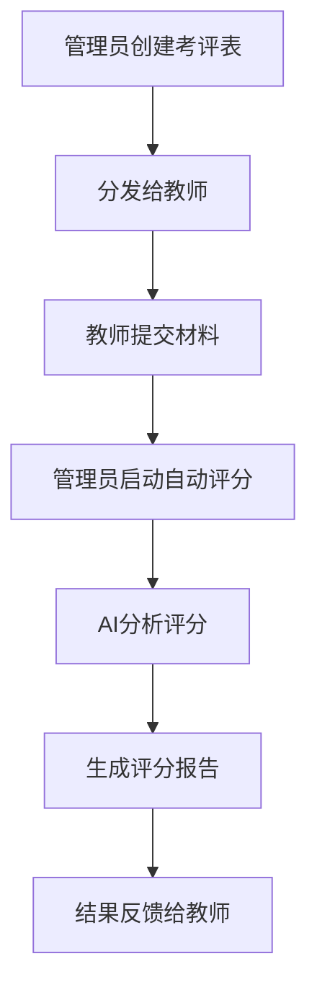

# DeepSeek AI自动评分系统使用指南

## 📋 目录
1. [系统概述](#系统概述)
2. [功能特点](#功能特点)
3. [评分标准](#评分标准)
4. [使用流程](#使用流程)
5. [操作指南](#操作指南)
6. [评分结果解读](#评分结果解读)
7. [常见问题](#常见问题)
8. [最佳实践](#最佳实践)

---

## 🎯 系统概述

DeepSeek AI自动评分系统是基于先进的人工智能技术开发的教学材料智能评估工具。系统能够自动分析教师提交的教学材料（教案、教学反思、听课记录等），并根据专业的教学评价标准给出客观、准确的评分和改进建议。

### 核心优势
- **🤖 AI驱动**: 基于DeepSeek大语言模型，具备强大的文本理解和分析能力
- **📊 专业评估**: 采用教育部门认可的评价标准和指标体系
- **⚡ 高效便捷**: 秒级完成评分，大幅提升评教工作效率
- **🎯 精准反馈**: 提供详细的评分理由和具体改进建议
- **🔍 质量把控**: 内置一票否决机制，确保评分质量

---

## ✨ 功能特点

### 1. 多类型材料支持
- **教案**: 教学目标、内容、方法、评价四个维度评估
- **教学反思**: 反思深度、内容、改进措施、理论支撑四个维度
- **教研/听课记录**: 记录完整性、观察分析、评价建议、专业性
- **成绩/学情分析**: 数据完整性、分析深度、改进措施、专业性
- **课件**: 内容质量、设计美观、媒体运用、教学适用性

### 2. 智能评分机制
- **基础评分**: 按照各维度权重进行综合评分
- **加分项**: 支持创新亮点、特色做法等加分
- **一票否决**: 自动识别严重问题，触发否决机制
- **等级判定**: 自动划分优秀、良好、合格、不合格四个等级

### 3. 批量处理能力
- **单个评分**: 针对特定提交进行详细评分
- **批量评分**: 同时处理多个提交，提高工作效率
- **进度跟踪**: 实时显示评分进度和结果统计

---

## 📏 评分标准

### 教案评分标准（总分100分）
| 评价维度 | 权重 | 评分要点 |
|---------|------|----------|
| 教学目标 | 25分 | 目标明确、具体、可测量，符合课程标准 |
| 教学内容 | 25分 | 内容准确、完整、逻辑清晰，重难点突出 |
| 教学方法 | 25分 | 方法多样、适宜、创新，体现学生主体地位 |
| 教学评价 | 25分 | 评价方式多元、标准明确、反馈及时 |

### 教学反思评分标准（总分100分）
| 评价维度 | 权重 | 评分要点 |
|---------|------|----------|
| 反思深度 | 30分 | 深入分析教学过程，具有批判性思维 |
| 反思内容 | 30分 | 内容全面、具体、有数据支撑 |
| 改进措施 | 25分 | 措施针对性强、具体可行、系统性好 |
| 理论支撑 | 15分 | 结合教育理论，指导实践改进 |

### 一票否决项
#### 通用否决项
- 造假、抄袭等学术不端行为
- 师德失范相关内容
- 未提交核心文件或内容为空

#### 专项否决项
- **教案**: 教学目标完全缺失、内容存在严重知识性错误
- **教学反思**: 反思内容与教学无关、内容过于简单
- **听课记录**: 记录内容与教研/听课无关、缺少基本信息
- **学情分析**: 分析内容与成绩/学情无关、缺少数据支撑
- **课件**: 内容与教学主题无关、存在严重知识性错误

---

## 🔄 使用流程

### 完整评教流程


### 详细步骤说明
1. **准备阶段**: 管理员制定评分标准，创建考评表模板
2. **分发阶段**: 将考评表分发给目标教师群体
3. **提交阶段**: 教师根据要求提交相应的教学材料
4. **评分阶段**: 管理员使用AI系统进行自动评分
5. **反馈阶段**: 将评分结果和改进建议反馈给教师

---

## 📖 操作指南

### 管理员操作

#### 1. 登录系统
```
访问地址: http://localhost:3000
用户名: admin
密码: 123456
```

#### 2. 查看提交材料
1. 进入"材料管理"页面
2. 查看教师提交的材料列表
3. 可按状态、教师、时间等条件筛选

#### 3. 单个材料评分
1. 在材料列表中找到要评分的提交
2. 点击"自动评分"按钮
3. 系统自动调用DeepSeek API进行评分
4. 查看详细的评分结果和建议

#### 4. 批量评分
1. 在材料列表中勾选多个提交
2. 点击"批量评分"按钮
3. 系统依次处理所有选中的提交
4. 查看批量评分的统计结果

#### 5. 评分结果管理
1. 查看所有评分记录
2. 导出评分报告
3. 修改评分结果（如需要）
4. 向教师发送反馈

### 教师操作

#### 1. 接收考评任务
1. 登录教师端系统
2. 查看分配的考评任务
3. 了解提交要求和截止时间

#### 2. 提交教学材料
1. 进入"材料提交"页面
2. 上传相应的文件（支持PDF、Word、TXT等格式）
3. 填写提交说明
4. 确认提交

#### 3. 查看评分结果
1. 在"评分结果"页面查看AI评分
2. 阅读详细的评分报告
3. 根据改进建议优化教学

---

## 📊 评分结果解读

### 评分报告结构
```json
{
  "基础分数": 85,
  "加分项": 5,
  "最终得分": 90,
  "评定等级": "优秀",
  "是否触发否决": false,
  "详细评分": [
    {
      "评价维度": "教学目标",
      "得分": "22/25",
      "评分理由": "目标明确具体，符合课程标准..."
    }
  ],
  "AI总结": "整体评价和改进建议...",
  "评分时间": "2024-02-04 10:30:00"
}
```

### 等级划分标准
- **优秀 (90-100分)**: 教学材料质量很高，各项指标表现突出
- **良好 (80-89分)**: 教学材料质量较好，大部分指标达到要求
- **合格 (60-79分)**: 教学材料基本合格，部分指标需要改进
- **不合格 (<60分)**: 教学材料存在明显问题，需要重新准备

### 评分理由解读
- **具体量化**: AI会给出具体的分数和百分比数据
- **问题定位**: 准确指出存在的问题和不足
- **改进方向**: 提供具体可行的改进建议
- **理论支撑**: 结合教育理论给出专业指导

---

## ❓ 常见问题

### Q1: 系统支持哪些文件格式？
**A**: 目前支持以下格式：
- 文本文件：TXT
- Word文档：DOC, DOCX
- PDF文件：PDF
- 演示文稿：PPT, PPTX
- 表格文件：XLS, XLSX

### Q2: 评分需要多长时间？
**A**: 
- 单个文件评分：通常在10-30秒内完成
- 批量评分：根据文件数量，每个文件约需20-40秒
- 文件大小和内容复杂度会影响处理时间

### Q3: 如果对评分结果有异议怎么办？
**A**: 
1. 可以查看详细的评分理由和AI分析过程
2. 管理员可以手动调整评分结果
3. 建议根据AI的改进建议优化材料后重新提交

### Q4: 系统如何保证评分的公平性？
**A**: 
1. 采用统一的评分标准和权重
2. AI评分不受主观因素影响
3. 所有评分过程和结果都有详细记录
4. 支持评分结果的追溯和审核

### Q5: 评分系统的准确率如何？
**A**: 
- 基于大量教学材料训练，准确率较高
- 对于标准化程度高的材料（如教案）准确率更高
- 建议结合人工审核确保最终质量

---

## 🎯 最佳实践

### 管理员最佳实践

#### 1. 评分前准备
- **明确标准**: 向教师明确说明评分标准和要求
- **样例展示**: 提供优秀材料样例供教师参考
- **技术测试**: 评分前先用少量材料测试系统功能

#### 2. 评分过程管理
- **分批处理**: 对于大量材料，建议分批进行评分
- **结果审核**: 对异常评分结果进行人工审核
- **及时反馈**: 尽快将评分结果反馈给教师

#### 3. 质量控制
- **抽样检查**: 定期抽查AI评分结果的准确性
- **标准调整**: 根据实际情况适时调整评分标准
- **持续改进**: 收集反馈意见，不断优化评分流程

### 教师最佳实践

#### 1. 材料准备
- **内容完整**: 确保提交的材料内容完整、结构清晰
- **格式规范**: 使用标准的文档格式，避免格式错误
- **质量把关**: 提交前自行检查，确保没有明显错误

#### 2. 提交注意事项
- **及时提交**: 在截止时间前完成提交，避免延误
- **备份保存**: 保留材料的备份，以备后续需要
- **说明清楚**: 在提交说明中简要介绍材料特点

#### 3. 结果利用
- **认真阅读**: 仔细阅读AI评分报告和改进建议
- **对照改进**: 根据建议对教学材料进行优化
- **持续提升**: 将评分结果作为教学改进的重要参考

---

## 🔧 技术支持

### 系统要求
- **浏览器**: Chrome 80+, Firefox 75+, Safari 13+
- **网络**: 稳定的互联网连接
- **文件大小**: 单个文件不超过50MB

### 联系方式
- **技术支持**: tech-support@example.com
- **使用咨询**: user-help@example.com
- **问题反馈**: feedback@example.com

### 更新日志
- **v1.0.0** (2024-02-04): 初始版本发布
  - 支持5种材料类型的自动评分
  - 集成DeepSeek AI评分引擎
  - 实现批量评分功能

---

## 📝 附录

### 评分标准详细说明
详细的评分标准和示例请参考：
- [教案评分标准详解](./教案评分标准.md)
- [教学反思评分标准详解](./教学反思评分标准.md)
- [其他材料评分标准](./其他材料评分标准.md)

### API接口文档
开发者可参考：
- [评分API接口文档](./API文档.md)
- [系统集成指南](./集成指南.md)

---

*本指南最后更新时间：2024年2月4日*
*版本：v1.0.0*