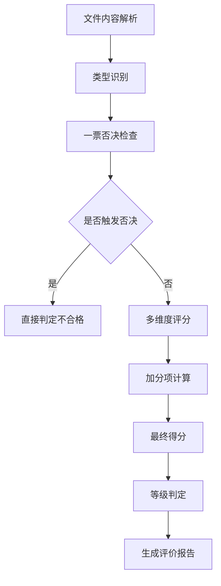

# 📏 DeepSeek自动评分系统评分标准详细说明

## 📋 目录
1. [评分体系概述](#评分体系概述)
2. [教案评分标准](#教案评分标准)
3. [教学反思评分标准](#教学反思评分标准)
4. [教研听课记录评分标准](#教研听课记录评分标准)
5. [成绩学情分析评分标准](#成绩学情分析评分标准)
6. [课件评分标准](#课件评分标准)
7. [一票否决机制](#一票否决机制)
8. [加分项规则](#加分项规则)
9. [评分示例](#评分示例)

---

## 🎯 评分体系概述

### 评分原则
- **客观公正**：基于明确的评价标准，避免主观偏见
- **全面系统**：多维度评价，确保评估的全面性
- **专业导向**：符合教育教学专业要求和发展趋势
- **发展性评价**：注重改进建议，促进教师专业发展

### 评分流程


### 等级划分
| 等级 | 分数区间 | 描述 |
|------|----------|------|
| 优秀 | 90-100分 | 各项指标表现突出，具有示范价值 |
| 良好 | 80-89分 | 大部分指标达到要求，整体质量较高 |
| 合格 | 60-79分 | 基本达到要求，部分方面需要改进 |
| 不合格 | <60分 | 存在明显问题，需要重新准备 |

---

## 📚 教案评分标准

### 总体要求
教案应体现完整的教学设计思路，包含教学目标、内容安排、方法选择、评价设计等核心要素。

### 评分维度（总分100分）

#### 1. 教学目标（25分）
**评分要点**：
- **明确性**（8分）：目标表述清晰、具体、可测量
- **适宜性**（8分）：符合课程标准和学生实际水平
- **完整性**（9分）：包含知识、能力、情感三个维度

**优秀标准（23-25分）**：
- 目标表述具体明确，使用可观察、可测量的行为动词
- 目标设置符合学生认知规律和课程标准要求
- 三维目标设计完整，层次清晰，相互关联

**良好标准（20-22分）**：
- 目标表述较为明确，基本可测量
- 目标设置基本符合要求，有一定的适宜性
- 三维目标基本完整，但层次性不够清晰

**合格标准（15-19分）**：
- 目标表述基本明确，但部分过于宽泛
- 目标设置基本合理，但针对性不强
- 三维目标不够完整，缺少部分维度

**不合格标准（<15分）**：
- 目标表述模糊，难以测量
- 目标设置不当，脱离实际
- 三维目标严重缺失

#### 2. 教学内容（25分）
**评分要点**：
- **准确性**（8分）：内容科学准确，无知识性错误
- **完整性**（8分）：内容完整，逻辑清晰，结构合理
- **重难点**（9分）：重点突出，难点处理得当

**优秀标准（23-25分）**：
- 教学内容科学准确，体现学科前沿
- 内容安排完整系统，逻辑清晰，层次分明
- 重难点把握准确，处理策略恰当有效

#### 3. 教学方法（25分）
**评分要点**：
- **多样性**（8分）：方法多样，组合恰当
- **适宜性**（8分）：方法选择符合内容特点和学生特点
- **创新性**（9分）：体现新的教学理念和方法

**优秀标准（23-25分）**：
- 教学方法多样化，能够灵活运用多种方法
- 方法选择恰当，符合教学内容和学生特点
- 体现先进的教学理念，有创新性做法

#### 4. 教学评价（25分）
**评分要点**：
- **多元性**（8分）：评价方式多样，形式丰富
- **过程性**（8分）：注重过程评价，及时反馈
- **发展性**（9分）：评价促进学生发展

**优秀标准（23-25分）**：
- 评价方式多元化，包含诊断性、形成性、总结性评价
- 评价贯穿教学全过程，反馈及时有效
- 评价标准明确，促进学生全面发展

---

## 🤔 教学反思评分标准

### 总体要求
教学反思应基于具体的教学实践，体现教师的批判性思维和专业发展意识。

### 评分维度（总分100分）

#### 1. 反思深度（30分）
**评分要点**：
- **批判性思维**（10分）：能够客观分析教学过程中的问题
- **深入分析**（10分）：不仅描述现象，更要分析原因
- **自我审视**（10分）：能够反思自己的教学行为和理念

**优秀标准（27-30分）**：
- 具有强烈的批判意识，能够客观审视教学过程
- 分析深入透彻，能够挖掘问题的深层原因
- 体现出高度的自我反思意识和专业自觉

**评分示例**：
```
优秀反思：
"通过课堂观察发现，学生在理解ε-δ定义时普遍存在困难，
正确率仅60%。深入分析原因：一是抽象概念缺乏具体实例支撑，
二是学生逻辑推理基础薄弱，三是我在教学中过于急躁，
没有给学生充分的思考时间..."

一般反思：
"这节课学生掌握得不太好，需要多练习。"
```

#### 2. 反思内容（30分）
**评分要点**：
- **全面性**（10分）：涵盖教学的各个环节
- **具体性**（10分）：有具体的事例和数据支撑
- **针对性**（10分）：针对具体问题进行反思

**优秀标准（27-30分）**：
- 反思内容全面，涵盖目标达成、方法运用、学生反应等
- 有具体的数据支撑和典型事例
- 针对性强，问题定位准确

#### 3. 改进措施（25分）
**评分要点**：
- **针对性**（8分）：措施针对发现的问题
- **可行性**（8分）：措施具体可行，操作性强
- **系统性**（9分）：措施系统全面，考虑周到

**优秀标准（23-25分）**：
- 改进措施与问题分析高度对应
- 措施具体详细，具有很强的可操作性
- 措施系统全面，形成完整的改进方案

#### 4. 理论支撑（15分）
**评分要点**：
- **理论运用**（7分）：能够运用教育理论分析问题
- **理论结合**（8分）：理论与实践结合紧密

**优秀标准（14-15分）**：
- 能够恰当运用相关教育理论
- 理论与实践结合自然，指导性强

---

## 👥 教研听课记录评分标准

### 总体要求
教研听课记录应真实记录听课过程，体现专业的观察和分析能力。

### 评分维度（总分100分）

#### 1. 记录完整性（25分）
- 基本信息完整（时间、地点、授课教师、课题等）
- 教学过程记录详细
- 学生反应记录真实

#### 2. 观察分析（30分）
- 观察角度多元化
- 分析客观深入
- 能够发现亮点和问题

#### 3. 评价建议（30分）
- 评价客观公正
- 建议具体可行
- 体现专业水准

#### 4. 专业性（15分）
- 使用专业术语准确
- 体现教育理论素养
- 符合教研规范

---

## 📊 成绩学情分析评分标准

### 总体要求
成绩学情分析应基于真实数据，体现科学的分析方法和专业判断。

### 评分维度（总分100分）

#### 1. 数据完整性（20分）
- 数据来源可靠
- 数据类型丰富
- 数据处理规范

#### 2. 分析深度（35分）
- 统计分析科学
- 问题诊断准确
- 原因分析深入

#### 3. 改进措施（30分）
- 措施针对性强
- 策略具体可行
- 预期效果明确

#### 4. 专业性（15分）
- 分析方法科学
- 结论客观可信
- 表达规范专业

---

## 💻 课件评分标准

### 总体要求
课件应服务于教学目标，体现良好的设计理念和技术水平。

### 评分维度（总分100分）

#### 1. 内容质量（25分）
- 内容准确完整
- 逻辑清晰合理
- 重点突出明确

#### 2. 设计美观（25分）
- 版面设计合理
- 色彩搭配协调
- 字体选择恰当

#### 3. 媒体运用（25分）
- 多媒体元素丰富
- 技术运用恰当
- 交互设计合理

#### 4. 教学适用性（25分）
- 符合教学目标
- 适合学生特点
- 便于课堂使用

---

## ❌ 一票否决机制

### 通用否决项
1. **学术不端**
   - 抄袭、造假等行为
   - 触发条件：检测到大段雷同内容
   - 处理：直接判定为不合格（0分）

2. **师德失范**
   - 违背师德规范的内容
   - 触发条件：包含不当言论或行为
   - 处理：直接判定为不合格（0分）

3. **核心缺失**
   - 未提交核心文件或内容为空
   - 触发条件：文件无法解析或内容过少
   - 处理：直接判定为不合格（0分）

### 专项否决项

#### 教案专项否决
- **目标完全缺失**：教案中没有教学目标部分
- **知识性错误**：教学内容存在严重的学科知识错误

#### 教学反思专项否决
- **内容无关**：反思内容与教学完全无关
- **过于简单**：反思内容过于简单，缺乏实质性内容

#### 听课记录专项否决
- **内容无关**：记录内容与教研/听课活动无关
- **信息缺失**：缺少基本的听课信息（时间、地点、授课人等）

#### 学情分析专项否决
- **内容无关**：分析内容与成绩/学情完全无关
- **数据缺失**：缺少必要的数据支撑

#### 课件专项否决
- **主题无关**：课件内容与教学主题完全无关
- **知识错误**：课件中存在严重的知识性错误

---

## ⭐ 加分项规则

### 加分项类型
1. **创新亮点**（最高5分）
   - 教学方法创新
   - 技术应用创新
   - 评价方式创新

2. **特色做法**（最高3分）
   - 具有学校或地区特色
   - 体现个人教学风格
   - 适应特殊教学环境

3. **理论结合**（最高2分）
   - 深度结合教育理论
   - 体现前沿教学理念
   - 理论指导实践明显

### 加分限制
- 单项加分不超过5分
- 总加分不超过10分
- 最终得分不超过100分

---

## 📝 评分示例

### 示例1：优秀教学反思（95分）

**材料特点**：
- 反思深入系统，有量化数据支撑
- 问题分析准确，原因挖掘深入
- 改进措施具体可行，系统性强
- 理论结合自然，专业性突出

**AI评分结果**：
```
反思深度：28/30分 - 反思深入、系统，体现批判性思维
反思内容：29/30分 - 内容全面具体，数据支撑有力
改进措施：24/25分 - 措施针对性强，具体可行
理论支撑：14/15分 - 理论运用恰当，指导性强
总分：95分（优秀）
```

### 示例2：不合格教案（0分）

**材料特点**：
- 教学反思部分过于简单
- 仅有概括性陈述，缺乏具体分析
- 触发"反思内容过于简单"否决项

**AI评分结果**：
```
触发否决项：专项否决项 - 反思内容过于简单
最终得分：0分（不合格）
否决原因：反思内容仅有两句概括性陈述，缺乏具体分析
```

---

## 🔄 评分标准更新机制

### 更新原则
- 基于实际使用反馈
- 结合教育发展趋势
- 保持标准的科学性和公正性

### 更新流程
1. 收集使用反馈
2. 专家论证评估
3. 试点测试验证
4. 正式发布更新

### 版本管理
- 主版本：重大标准调整
- 次版本：评分细则优化
- 修订版：错误修正和完善

---

*评分标准详细说明 v1.0.0 | 更新时间：2024-02-04*